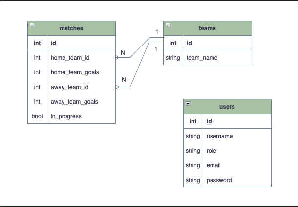

# Boas vindas ao repositório do meu projeto Trybe Futebol Clube(TFC)!
Essa é uma plicação que desenvolvi durante dos meus estudos na [Trybe](https://www.betrybe.com).

# Resumo

O `TFC` é um site informativo sobre partidas e classificações de futebol! ⚽️

No desenvolvimento desse projeto, fui responsável por criar a API seguindo a abordagem TDD e garantir a integração das aplicações usando Docker Compose, para que todas funcionassem consumindo um banco de dados.
Para isso, desenvolvemos um back-end dockerizado, modelando os dados com Sequelize e implementando todas as regras de negócio definidas no projeto. O objetivo era garantir que a API fornecesse corretamente os dados necessários para o front-end já disponível, 
permitindo que a tabela de classificação fosse exibida corretamente para os usuários do sistema.

#🚀 Tecnologias utilizadas
---


---
<details>
  <summary>📊 Diagrama Relacional de Entidades</summary>
  
  

</details>

---
# 🖥️ Iniciando a aplicação

Para configurar e executar a aplicação corretamente, siga os passos abaixo:

# 👥 Clonando o repositório

Primeiro, copie o repositório para uma pasta local usando o seguinte comando no terminal:

git clone git@github.com:Gustavo-GPG/FutebolClube.git

Caso você não tenha o Git instalado, siga as instruções de instalação conforme o seu sistema operacional:

Debian/Ubuntu (Terminal Bash):

sudo apt-get install git

Windows (PowerShell):

winget install --id Git.Git -e --source winget

Ou acesse a documentação oficial do Git para mais opções de instalação.

# 📦 Instalando as dependências

Acesse a pasta app dentro do projeto:

cd app

Instale as dependências principais do projeto:

npm install

Para instalar as dependências específicas de cada aplicação, utilize os seguintes scripts:

Front-end:
```
npm run install:front
```
Back-end:
```
npm run install:back
```
Ambos (Front + Back):
```
npm run install:apps
```
Observação: As dependências do projeto e das aplicações front-end e back-end devem ser instaladas antes de continuar.

# 🚀 Iniciando a aplicação

Após instalar todas as dependências, execute o seguinte comando dentro da pasta app para iniciar os containers da aplicação:
```
npm run compose:up
```
Esse comando iniciará os containers Docker que hospedam a aplicação.

# 🌐 Acessando a aplicação

Com a aplicação em execução, basta acessar no navegador:
```
http://localhost:3000
```
Lá, você poderá visualizar a interface do front-end funcionando corretamente.

# 📝 Visualizando logs da aplicação

Para monitorar os logs da aplicação, utilize os seguintes comandos:

Para visualizar todos os logs:
```
docker-compose logs
```
Para visualizar logs de um serviço específico:
```
docker-compose logs <nome-do-seu-serviço>
```
Com isso, você pode acompanhar o status da aplicação e identificar possíveis erros.

Para iniciar a aplicação navegue para a pasta src/main/java/com/betrybe/agrix/AgrixApplication.java e inicie a aplicação.

⚠️**Atenção:** A aplicação usa por padrão a porta 3000 para frontend e 3001 para backend

Agora é só abrir o navegador e colocar o endereço http://localhost:3000/
---

Este projeto foi guiado por requisitos pré-estabelecidos pela [Trybe](https://www.betrybe.com).
